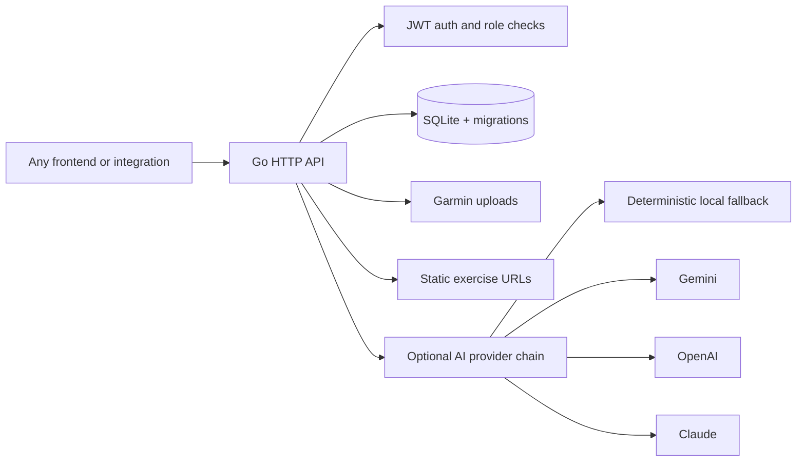

# STAFF App API


STAFF App API is an open-source backend for building fitness, sport and health
applications. It exists to help developers, coaches, students and makers create
real-world e-fitness systems without starting from zero or depending on closed,
expensive platforms.

Frontend-agnostic Go backend for student management, anamnese intake,
training-sheet workflows, running periodization, Garmin activity processing,
SVED metrics, exercise libraries, local RAG and administrative reporting.

The project provides a complete HTTP/JSON API that any frontend can build on:
web apps, Flutter, native mobile, desktop clients, CLIs or internal integrations.
The Go backend returns structured JSON instead of server-rendered HTML, so
consumers are free to choose their own visual stack.

> Versioning follows Semantic Versioning. The project is currently in the `v0.x`
> line, where API changes may still happen with release notes.

## Table of Contents

- [Why STAFF App API](#why-staff-app-api)
- [Capabilities](#capabilities)
- [Architecture](#architecture)
- [Quickstart](#quickstart)
- [Configuration](#configuration)
- [Using the API](#using-the-api)
- [Interactive API docs](#interactive-api-docs)
- [Docker](#docker)
- [Quality Gates](#quality-gates)
- [Operational Scripts](#operational-scripts)
- [Repository Package](#repository-package)
- [Contributing](#contributing)
- [Security](#security)
- [License](#license)

## Why STAFF App API

STAFF App API is a clean-room Go refactor of the legacy backend into a codebase
that is easier to operate, test and integrate.

- **Frontend-agnostic by design**: stable HTTP/JSON contracts in
  `openapi.yaml`, with no coupling to templates, Jinja, HTMX or Flutter.
- **Training-first backend**: supports strength training sheets, running
  periodization, Daniels/VDOT, SVED, history, frequency, feedback and Garmin.
- **AI optional, deterministic core**: training generation has a safe local
  path; AI providers can enrich output but are not required.
- **SQLite operational**: idempotent migrations, consistent backups, Docker
  volumes and API-only smoke/E2E validation.
- **Open source ready**: Apache-2.0, license policy, community files, linted
  OpenAPI, SAST and secret scanning in the release checklist.

## Capabilities

| Area | What is included |
|---|---|
| Auth & users | JWT, bootstrap admin, user approval, activation and plans |
| Students | Student CRUD, search, frequency and consolidated history |
| Anamnese | Public pre-registration, tokens, submission, approval/rejection and operational e-mail |
| Training sheets | Manual and periodized sheets, public links, feedback and optimistic concurrency control |
| Running | Running periodization, dynamic Daniels blocks, monthly calendar and public links |
| Garmin | FIT/CSV upload, activity persistence, records, analytics and Plotly-compatible chart data |
| Exercises | CSV + database library, therapeutic exercises, RAG suggestions and static asset URLs |
| SVED | Individual/batch calculation, history, suggestions and student dashboard |
| Knowledge base | RAG queries with SQLite cache and local fallback without external keys |
| Admin reports | Dashboard, pathologies, underused exercises, suggestion approval and system settings |

## Architecture



The API is the product boundary. Frontends should depend on `openapi.yaml`, not
on internal Go packages or legacy HTML templates.

Runtime assets are intentionally split:

- Exercise metadata lives in SQLite and `data/csv`.
- Running block templates live in `data/json`.
- Exercise images/HTML/GIFs are served by the external static site
  `https://rcstorestaff.com.br/exercicios_html/{codigo}.html`.
- Legacy Python reference code under `api/` is not part of the public package.

## Quickstart

### Requirements

- Go 1.25.12 or newer toolchain
- Docker and Docker Compose, optional but recommended for staging-like runs
- `curl`

### Run locally

```bash
cp .env.example .env
GOCACHE=/tmp/go-build-cache GOWORK=off go run ./cmd/api
```

Check health:

```bash
curl -s http://localhost:5000/health
```

Expected shape:

```json
{
  "database": "connected",
  "status": "ok",
  "version": "1.0.0"
}
```

## Configuration

Create `.env` from `.env.example` and replace development placeholders before
using production-like settings.

```env
ENV=development
PORT=5000
DB_PATH=fichas_treino.db
SECRET_KEY=dev-secret-key-change-me-in-production

ADMIN_DEFAULT_USERNAME=admin
ADMIN_DEFAULT_EMAIL=admin@example.com
ADMIN_DEFAULT_PASSWORD=admin-change-me-immediately

CORS_ORIGINS=https://rcstorestaff.com.br,https://www.rcstorestaff.com.br,http://localhost:*,http://127.0.0.1:*
GARMIN_UPLOAD_DIR=uploads_atividades
GARMIN_MAX_UPLOAD_MB=50

# Knowledge Base / RAG. Empty values use SQLite fallback.
OPENAI_API_KEY=
CHROMA_URL=
CHROMA_COLLECTION=knowledge_base

# AI training generation / enrichment.
AI_TRAINING_MODE=assistive
AI_TRAINING_PROVIDERS=gemini,openai,claude,local
AI_TRAINING_PROVIDER_TIMEOUT_SECONDS=20
GEMINI_API_KEY=
GOOGLE_API_KEY=
GEMINI_MODEL=gemini-2.5-flash-lite
OPENAI_TRAINING_MODEL=gpt-4o-mini
CLAUDE_API_KEY=
ANTHROPIC_API_KEY=
CLAUDE_TRAINING_MODEL=claude-3-5-haiku-latest
```

Production safety rules:

- `ENV=production` requires a real `SECRET_KEY`.
- `ENV=production` requires a real `ADMIN_DEFAULT_PASSWORD` if bootstrap admin
  is enabled.
- Do not commit `.env`, databases, logs, backups or uploaded Garmin files.
- `AI_TRAINING_MODE=off` uses deterministic local generation only.
- `AI_TRAINING_MODE=assistive` tries configured providers and falls back to
  local generation.
- `AI_TRAINING_MODE=required` returns an error if no AI provider succeeds.

## Using the API

The formal API contract is [`openapi.yaml`](openapi.yaml).

Base URL for local development:

```text
http://localhost:5000
```

### Login

```bash
curl -s -X POST http://localhost:5000/api/v1/auth/login \
  -H 'Content-Type: application/json' \
  -d '{"username":"admin","password":"admin-change-me-immediately"}'
```

The response includes a JWT token. Send it to protected routes:

```bash
TOKEN='<jwt>'

curl -s http://localhost:5000/api/v1/auth/me \
  -H "Authorization: Bearer $TOKEN"
```

### Typical staff workflow

1. Create or approve a student.
2. Generate an anamnese token and collect the public submission.
3. Approve or reject the anamnese clinically.
4. Create a manual sheet or generate a periodized plan.
5. Publish a public training-sheet or running-plan link.
6. Receive training completions, feedback and Garmin activity uploads.
7. Review SVED, RAG-backed suggestions and administrative reports.

### Contract conventions

- JSON fields use `snake_case` intentionally for legacy compatibility.
- Protected routes use `Authorization: Bearer <token>`.
- Some public workout completion endpoints support optional Bearer auth.
- Errors return JSON payloads such as `{"error":"message"}`.
- `204 No Content` is used for selected approval/delete actions.

### OpenAPI lint

```bash
/tmp/go-tools/vacuum lint -r vacuum-ruleset.yaml openapi.yaml
```

Current local contract status:

| Check | Result |
|---|---|
| OpenAPI vs router | 124 operations mapped |
| Vacuum | 0 errors, 0 warnings |
| Score | 97/100 |
| Accepted informs | Description duplication only |

## Interactive API docs

Explore [`openapi.yaml`](openapi.yaml) locally with open-source **Swagger UI** and
**Redoc**. No SwaggerHub subscription, no swagger.io login, no VPS and no GHCR.

1. Start the API (if you want **Try it out** to hit a live server):

```bash
docker compose up -d
curl -s http://localhost:5000/health
```

2. Start the docs stack:

```bash
./scripts/api_docs.sh up
```

Equivalent Compose command:

```bash
docker compose -f docker-compose.docs.yml up -d
```

3. Open in a browser:

| UI | URL |
|---|---|
| Swagger UI | http://localhost:8080 |
| Redoc | http://localhost:8081 |

The OpenAPI `servers` entry targets `http://localhost:5000`. Swagger UI **Try it
out** calls that API from your browser (CORS already allows `http://localhost:*`).
Browsing the docs works even when the API is stopped; live requests need step 1.

Stop docs:

```bash
./scripts/api_docs.sh down
```

Optional ports:

```bash
DOCS_PORT=8080 REDOC_PORT=8081 ./scripts/api_docs.sh up
```

## Docker

```bash
docker compose config
docker compose build
docker compose up -d
docker compose ps
curl -s http://localhost:5000/health
```

### Versioned release images

Build local tags (`staff_app_api:<version>` and `staff_app_api:sha-<short>`).
The image name matches the GitHub repository (`staff_app_api`), not a hyphenated alias.

```bash
./scripts/build_release_image.sh
```

Optional registry prefix (do not hardcode a private registry without authorization):

```bash
IMAGE_REGISTRY=ghcr.io/<owner> ./scripts/build_release_image.sh
# → ghcr.io/<owner>/staff_app_api:v0.1.0
```

On tag pushes (`v*`), GitHub Actions workflow `release-image` builds/pushes to
`ghcr.io/<owner>/<repo>` (i.e. `staff_app_api`) and uploads SBOM + module license
artifacts. Staging example:

```bash
export STAFF_APP_IMAGE=ghcr.io/rodrigochavesoa/staff_app_api:v0.1.0
export STAFF_APP_PULL_POLICY=always
docker compose -f docker-compose.yml -f docker-compose.staging.yml up -d
```

License / SBOM helpers:

```bash
./scripts/check_licenses.sh
./scripts/generate_sbom.sh
```

The container runs as a non-root user and persists data through named volumes:

| Volume | Mount | Purpose |
|---|---|---|
| `sqlite_data` | `/app/data/db` | SQLite database |
| `garmin_uploads` | `/app/uploads_atividades` | FIT/CSV uploads |

`data/csv` and `data/json` are copied into the image and are not hidden by the
SQLite volume.

## Quality Gates

Run from the project root:

```bash
GOCACHE=/tmp/go-build-cache GOWORK=off go test ./...
GOCACHE=/tmp/go-build-cache GOWORK=off go test -race ./...
GOCACHE=/tmp/go-build-cache GOWORK=off go vet ./...
GOCACHE=/tmp/go-build-cache GOWORK=off go build ./...
go run honnef.co/go/tools/cmd/staticcheck@v0.7.0 ./...
go run github.com/securego/gosec/v2/cmd/gosec@v2.22.10 ./...
go run golang.org/x/vuln/cmd/govulncheck@latest ./...
```

Secret scanning:

```bash
docker run --rm -v "$PWD:/repo" trufflesecurity/trufflehog:3.95.9 filesystem /repo --results=verified,unknown --fail
```

Local RC validation also passed:

- `go test ./...`
- `go test -race ./...`
- `go vet ./...`
- `go build ./...`
- `staticcheck`
- `gosec` with 0 issues
- `govulncheck` with 0 vulnerabilities in called code
- TruffleHog with 0 verified/unknown secrets
- Docker build + healthcheck
- smoke test
- E2E API-only journey

## Operational Scripts

### Backup

```bash
./scripts/backup.sh
```

Creates a consistent SQLite backup under `backups/`.

### Restore

```bash
./scripts/restore.sh ./backups/backup_YYYYMMDD_HHMMSS.db
```

Stops the API container, preserves a pre-restore copy, restores the database and
starts the API again.

### Interactive API docs

```bash
./scripts/api_docs.sh up
./scripts/api_docs.sh down
```

### Release image / licenses / SBOM

```bash
./scripts/build_release_image.sh
./scripts/check_licenses.sh
./scripts/generate_sbom.sh
```

### Smoke test

```bash
SMOKE_EXPECT_SMTP_FAILURE=true ./scripts/smoke_test.sh http://localhost:5000
```

`SMOKE_EXPECT_SMTP_FAILURE` modes:

| Value | Meaning |
|---|---|
| unset | Accepts SMTP success or controlled SMTP failure |
| `true` | Expects controlled SMTP failure, useful locally without SMTP |
| `false` | Expects successful e-mail delivery, useful in real staging |

### E2E API journey

```bash
./scripts/e2e_api_journey.sh http://localhost:5000
```

The E2E journey validates the API-only business flow: auth, pre-registration,
anamnese intake, students, training sheets, running, exercises, Garmin, SVED,
RAG, reports and important error cases.

## Repository Package

The preferred release strategy is a dedicated public repository for `staff_app`.

Files expected in the public package:

```text
.
|-- cmd/
|-- data/
|   |-- csv/
|   `-- json/
|-- internal/
|-- scripts/
|-- .github/
|-- Dockerfile
|-- docker-compose.yml
|-- go.mod
|-- go.sum
|-- openapi.yaml
|-- docker-compose.docs.yml
|-- scripts/api_docs.sh
|-- README.md
|-- CHANGELOG.md
|-- LICENSE
|-- LICENSE_POLICY.md
|-- CONTRIBUTING.md
|-- CODE_OF_CONDUCT.md
|-- SECURITY.md
|-- SUPPORT.md
`-- GOVERNANCE.md
```

Local-only material that must stay out of the public package:

- `.env`
- `*.db`, `*.db-*`
- `backups/`
- `logs/`
- `uploads_atividades/`
- `docs/`
- `api/`
- `frontend_lab/`

## Contributing

Contributions are welcome. Start with [`CONTRIBUTING.md`](CONTRIBUTING.md).

Good first areas:

- OpenAPI examples and SDK generation experiments
- Additional E2E scenarios
- Safer operational docs for SQLite backup/restore
- Exercise metadata improvements with permissive licensing
- Frontend integrations that consume only the public API contract

Project expectations:

- Keep handlers frontend-agnostic.
- Update `openapi.yaml` when changing public routes.
- Add tests for behavior, persistence and security-sensitive changes.
- Do not introduce GPL/AGPL/SSPL/non-commercial dependencies.
- Do not commit secrets, local databases, uploads or proprietary content.

## Security

Please do not open public issues for vulnerabilities. Follow
[`SECURITY.md`](SECURITY.md).

Security posture:

- JWT Bearer auth and admin-only route groups
- Strict production validation for default secrets
- Upload limits and path traversal defenses
- Non-root Docker runtime
- SAST and vulnerability checks in the release checklist
- TruffleHog secret scanning workflow documented for local and future CI use

## License

STAFF App API is licensed under the [Apache License 2.0](LICENSE).

Third-party dependency policy is documented in
[`LICENSE_POLICY.md`](LICENSE_POLICY.md). The project accepts permissive
licenses such as Apache-2.0, MIT, BSD, ISC and Zlib, and blocks copyleft or
non-commercial dependencies unless maintainers explicitly revise the policy.
